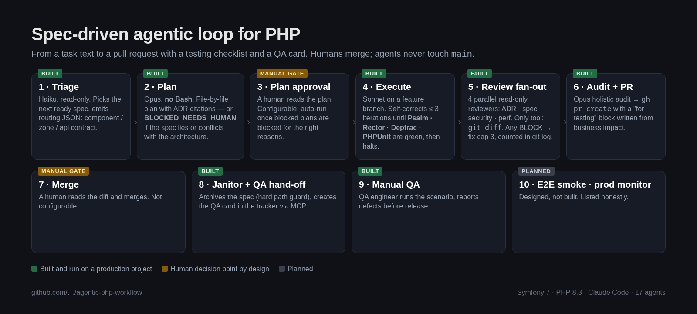
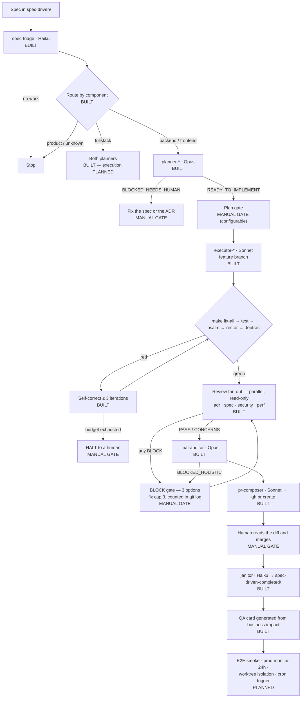
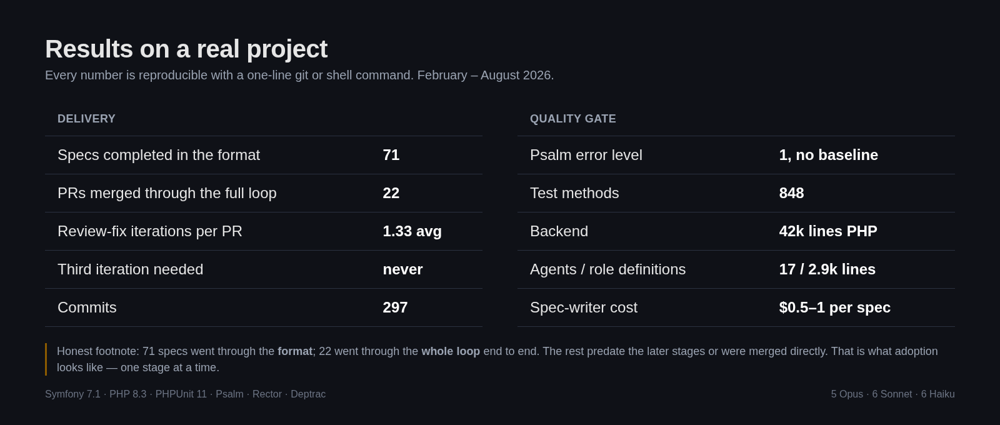

# Agentic PHP Workflow

A spec-driven autonomous development loop for PHP. You write a task as a spec; the loop plans it, implements it on a feature branch, runs the full static-analysis and test gate, fans out parallel read-only reviewers, audits the result holistically, and opens a pull request with a testing checklist and a QA card attached — and then stops, because a human merges. Static analysis is the gate throughout: Psalm, Rector, Deptrac and PHPUnit must be green before anything reaches review, and agents self-correct up to three iterations to get there.

This repository is a **sanitized template** extracted from a production system built and run by a two-person team (PHP engineer + QA engineer). It ships a curated subset — five agents, one orchestrator command, the guideline and ADR formats they depend on, and the tooling configs that make the gate real — not a full working installation. The value is in the structure and the guardrails, which are meant to be adapted to your project's domains and rules.

## What's in the box

| Path | What it is |
|---|---|
| `docs/PIPELINE.md` | The end-to-end loop, stage by stage, marked BUILT / MANUAL GATE / PLANNED |
| `docs/MODEL_BUDGET.md` | Which model does which job and why (Opus judges, Sonnet executes, Haiku triages) |
| `docs/GUARDRAILS.md` | The ten patterns that keep an autonomous loop from going wrong |
| `docs/STATIC_ANALYSIS.md` | Why the analysers are the load-bearing part, and how they plug into the self-correct loop |
| `.claude/agents/spec-triage.md` | Picks the next ready spec, emits routing metadata as JSON (Haiku, read-only) |
| `.claude/agents/planner-backend.md` | Produces a file-by-file plan with ADR citations, or blocks (Opus, **no Bash**) |
| `.claude/agents/executor-backend.md` | Implements the plan on a feature branch, self-corrects ≤ 3 iterations (Sonnet) |
| `.claude/agents/reviewer-adr.md` | Checks the diff against the ADRs (Sonnet, read-only, git-diff only) |
| `.claude/agents/janitor.md` | Archives merged specs, hard path guard to two directories (Haiku) |
| `.claude/commands/process-spec.md` | The orchestrator: routing, verdicts, human gate, review fan-out, iteration cap |
| `.claude/CLAUDE.md` | Project conventions the agents read |
| `.claude/TASK_GUIDELINES.md` | The spec template, including the machine-readable `## Components` section |
| `.claude/settings.json` | An allowlist example — read-only and build commands pre-approved, destructive ones denied |
| `spec-driven/001-example-invoice-export.md` | A realistic example spec in the template format |
| `adr/` | ADR index skeleton plus two short generic ADRs |
| `QA/README.md` | The QA scenario template and the "what the developer prepares" section |
| `tooling/` | `Makefile`, `psalm.xml`, `rector.php`, `deptrac.yaml` |
| `.github/workflows/ci.yml` | Lint + Psalm + Rector dry-run + Deptrac + tests |

## The pipeline

## Results on a real project

Metrics from the production system this template was extracted from (Symfony 7.1, PHP 8.3; February–August 2026). Every number is reproducible with a one-line git or shell command.

| Metric | Value |
|---|---|
| Specs written and completed in the spec-driven format | 71 (17k lines of specs) |
| Pull requests merged through the fully automated loop | 22 |
| Review-fix iterations per PR that needed one | 1.33 on average; a third iteration was never needed |
| Commits | 297 |
| Agents in the full system | 17 (5 Opus / 6 Sonnet / 6 Haiku), 2.9k lines of role definitions |
| Backend size | 42k lines of PHP in 982 files |
| Tests | 848 test methods in 209 files |
| Psalm | `errorLevel="1"`, **no baseline file** |
| Spec-writer cost | $0.5–1 per spec; a batch of 10 for $5–10 |

The honest footnote: 71 specs went through the *format*; 22 of them went through the *whole loop* end to end (triage → plan → execute → review → PR). The rest were done before the later stages existed or were merged directly. That is what adoption actually looks like — one stage at a time.

## Quality gates

Psalm, Rector, Deptrac and PHPUnit are **mandatory for humans and agents alike**. A rule that agents must satisfy and humans may bypass stops being a rule within a sprint, the baseline rots, and the signal the agents depend on disappears.

- **Psalm** at `errorLevel="1"` with the strict switches on, no baseline. A baseline is a list of errors you agreed to ignore, and an agent reads it as permission.
- **Rector** keeps the codebase from drifting behind its PHP level — which matters doubly with agents, since an agent imitates the code it reads.
- **Deptrac** enforces the layer and bounded-context boundaries the ADRs describe. It is the only gate that can prove the architecture in the documents is the architecture in the code.
- **PHPUnit** at four defined levels, with a written table saying which test every new public object requires.

**Agents self-correct up to three iterations** — for the whole executor run, not per step — until every gate is green. Budget exhausted means a halt with a structured report, not a fourth attempt. And a red run caused by a *logical* gap (a missing test, an unhandled edge case) is not self-correct territory at all: it halts and goes back to the planner, because a self-correct loop applied to a bad plan produces plausible code that is wrong.

**Reviewers are read-only.** They receive a branch name, read `git diff`, and report. They never check out, edit or push — an agent that can fix what it finds stops reporting and starts patching, and the human loses the finding.

## How to adopt this in your project

1. **Write your ADRs first.** This is the step people skip and the reason their loop produces garbage. Agents need prescriptive, citable rules — "handlers return a DTO, never a raw array" under a stable heading, not "we generally prefer DTOs". See `adr/README.md` for how to write rules an agent can comply with and a reviewer can check.
2. **Turn on the gate for humans.** Copy `tooling/` and `.github/workflows/ci.yml`, get to green, and make the checks required on your default branch. Until a human cannot merge red, an agent has no feedback loop worth the name.
3. **Adopt the spec format.** Copy `.claude/TASK_GUIDELINES.md` and write two or three real specs by hand, including the machine-readable `## Components` section the router depends on. `spec-driven/001-example-invoice-export.md` shows the expected level of detail.
4. **Wire the agents, one stage at a time.** Start with triage → planner and read the plans yourself; that alone is worth the setup. Add the executor once you trust the plans, then the reviewers, then the auditor and PR composer. Rename the example domains to yours throughout.
5. **Keep the manual gates until the loop earns them.** The plan-approval gate is configurable; the merge gate is not. Move the plan gate to auto-run only once blocked plans are consistently blocked for the right reasons.

## Team

**PHP engineer, 8 years.** Builds production PHP applications — from small, well-scoped changes to full-featured systems — on Symfony and Laravel, with the workflow above underneath: strict static analysis, an architecture written down in a form both people and agents can follow, and an agentic development loop on top of it. Before engineering: several years of running a business, which is why the specs in this repo talk about invoices, not abstractions.

**QA engineer, 4 years, e-commerce.** Manual integration and end-to-end testing of distributed systems: order-to-cash, refunds, 13+ payment providers, ERP/CRM/PIM integrations, loyalty. Release acceptance and go/no-go for 150+ releases a year. Uses Claude with MCP integrations for early requirements testing — draft checklists and test cases with expert review, cutting feature documentation from weeks to 1–2 days and catching 10–20 requirement defects before development starts. Migrated ~1,000 test cases between test-management tools in one working day with an AI agent.

We work as a pair: every feature can ship with a QA scenario in the format of `QA/README.md` and a test report, not just a PR.

## What we can do for you

| Package | What you get |
|---|---|
| **Feature → PR** | A spec in the template format, implementation on a feature branch, all gates green, a PR with a testing checklist |
| **Feature → PR + QA** | Same, plus a written QA scenario, a manual test pass and a defect report before you merge |
| **Workflow setup** | This loop adapted to your PHP project: ADRs, tooling gate, agents wired one stage at a time, your team trained to run it |
| **MCP servers** | Custom MCP servers for your internal APIs, issue trackers, test-management and CI tools, so agents can read and act on your real systems (the loop above uses one to hand finished work to QA) |

## License

MIT — see [LICENSE](LICENSE).
